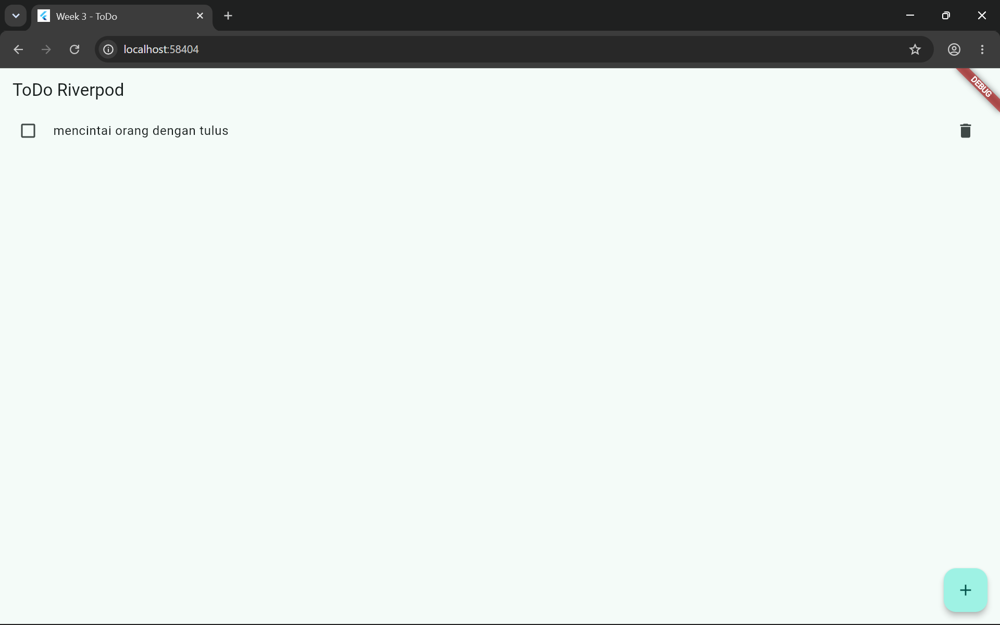
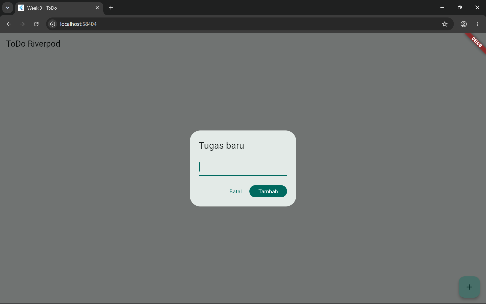
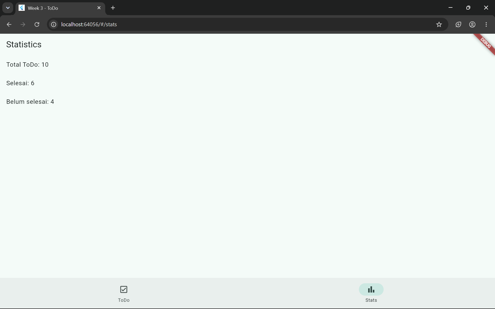
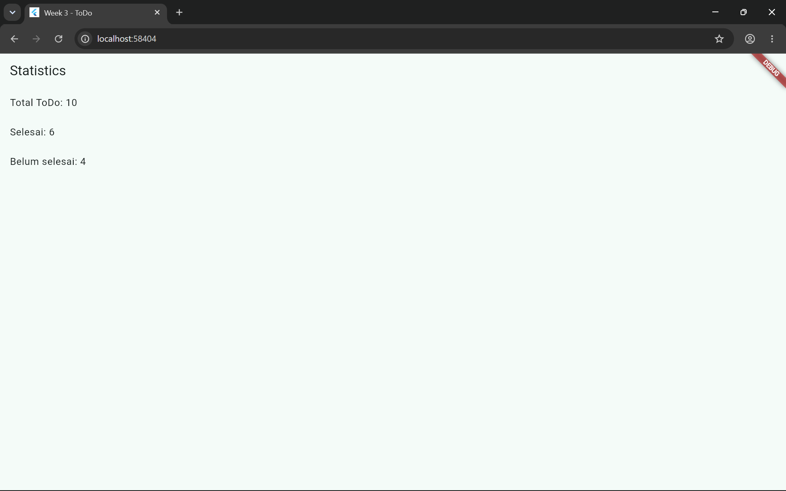

# ToDo App — Navigation & State Management (Week 3)

Flutter Codelab #03 — Politeknik Negeri Malang (JTI Polinema)

Name: Wahyu Fairuz Daniswara
NIM: 244107020225
Class: TI-3i
## Overview

A simple ToDo app demonstrating multi-page navigation with **GoRouter** and state management with **Riverpod**. Two main pages — **ToDo List** and **Stats** (simulated async fetch using `AsyncValue`) — connected via a bottom `NavigationBar`.

## Features

- GoRouter navigation: `/` (todo list) and `/stats` (statistics)
- Todo state managed with `Notifier` + `NotifierProvider` (add, toggle, delete)
- Derived `Provider` to filter unfinished todos
- `TodoTile` extracted as its own widget
- Stats page using `AsyncNotifier` — handles loading / error (with retry) / success
- Widget test + unit test for `StatsNotifier`

## Tech Stack

- Flutter SDK
- [go_router](https://pub.dev/packages/go_router)
- [flutter_riverpod](https://pub.dev/packages/flutter_riverpod)

## Run

```bash
flutter pub get
flutter run
```

Verify:

```bash
flutter analyze
flutter test
```

## Screenshots

| Screen | Preview |
|---|---|
| Todo list |  |
| Add task |  |
| Stats — success |  |
| Stats — data only |  |
| Stats — failed (retry) |  |

## AI Prompt Challenge

**Prompt used:**

```
Buatkan halaman Flutter bernama StatsPage menggunakan flutter_riverpod.
Requirements:
- ConsumerWidget dengan satu AsyncNotifierProvider yang mensimulasikan
  pengambilan data statistik (delay 2 detik, kadang gagal 30%).
- UI harus menangani loading (spinner), error (pesan + tombol retry),
  dan success (ListView 3 item).
- Berikan unit test untuk notifier-nya.
```

**Verification checklist:**

| Check | Result |
|---|---|
| State updated immutably (no `state.add()`) | done |
| `ref.watch` only in `build`, `ref.read` in callbacks | done |
| All 3 AsyncValue states handled | done |
| No legacy API (`StateProvider`, `StateNotifierProvider`) | done (replaced `StateProvider` with `Notifier<bool>`) |
| `flutter analyze` / `flutter test` clean | run locally and confirm |

**Fixes applied to the AI's first draft:** replaced manual `try/catch` with `AsyncValue.guard()`; replaced `StateProvider` with a `Notifier<bool>`; added `state = const AsyncLoading()` before `refresh()` so the spinner actually shows on retry.

## Reflection

- **`setState` vs Riverpod:** `setState` is enough for state local to one widget with no need to survive after it's disposed. Move to Riverpod once state is shared across pages, must persist across navigation, or needs to be testable independently of the UI.
- **`context.go` vs `context.push`:** `go` replaces the current location (no back stack) — good for switching between top-level tabs or after a redirect. `push` stacks a new route on top — good for opening a detail screen, since back returns to the previous one.
- **Why `AsyncValue` beats 3 booleans:** separate `isLoading`/`hasError`/`hasData` flags can end up in inconsistent combinations. `AsyncValue` models all three as one type, and `when()` forces every case to be handled at compile time.

## References

- [Flutter: Navigation overview](https://docs.flutter.dev/ui/navigation)
- [GoRouter package](https://pub.dev/packages/go_router)
- [Riverpod: Getting started](https://riverpod.dev/docs/introduction/getting_started)
- [Riverpod: AsyncNotifier & AsyncValue](https://riverpod.dev/docs/concepts/async_notifiers)
