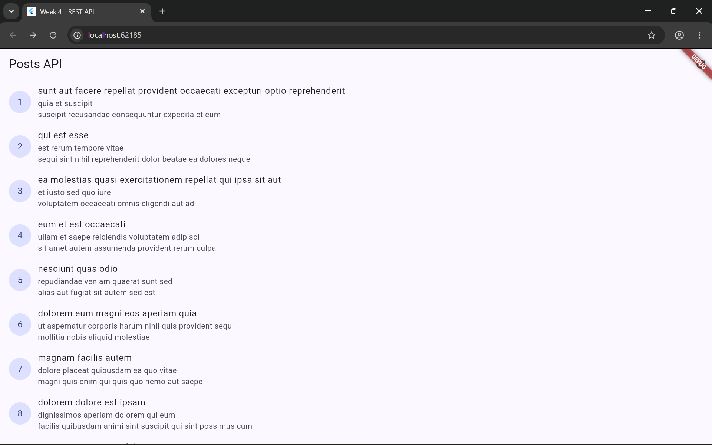
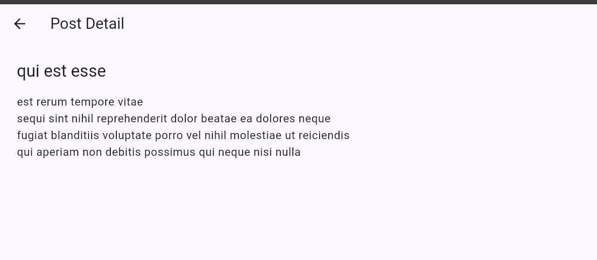
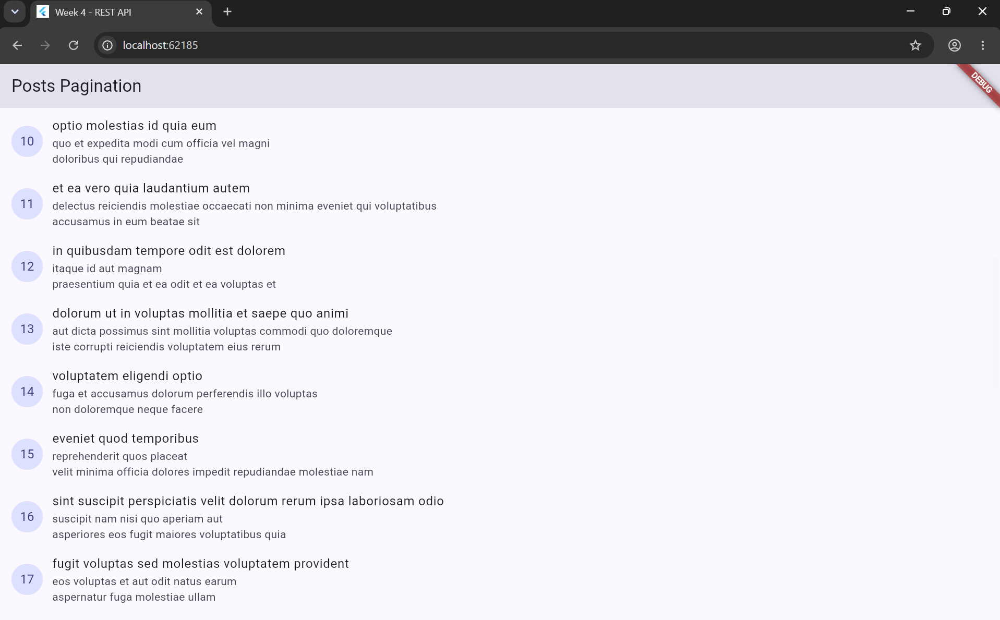
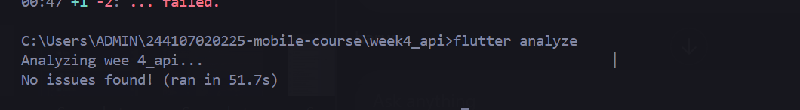
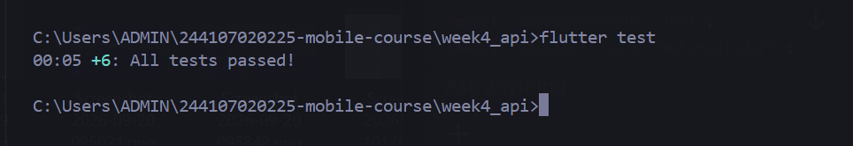

# Week 4 - Networking & REST API

**Name:** Wahyu Fairuz Daniswara  
**Student ID:** 244107020225  
**Class:** TI-2I  
**Course:** Mobile Programming  
**Project:** Week 4 - Networking & REST API

---

## 📚 Practicum Overview

This practicum focuses on connecting a Flutter application to a REST API using Dio and managing asynchronous data with Riverpod.

Topics covered:
- HTTP and REST API
- JSON data handling
- Null-safe Dart models
- Repository pattern
- Dio configuration
- Network error handling
- Riverpod `AsyncNotifier`
- Loading, success, and error states
- Pagination
- GoRouter navigation
- Refactoring
- Unit and widget testing
- AI-assisted development and verification

The API used is **JSONPlaceholder**.

---

## 🎯 Learning Objectives

After completing this practicum, I learned how to:

1. Understand HTTP and REST API.
2. Consume REST API data using Dio.
3. Convert JSON into null-safe Dart models.
4. Use the repository pattern.
5. Configure Dio with a base URL and timeout.
6. Handle loading, success, and error states with Riverpod.
7. Display API data in Flutter.
8. Implement API pagination.
9. Handle network errors with user-friendly messages.
10. Navigate to post details using GoRouter.
11. Refactor code into reusable widgets.
12. Create unit and widget tests.
13. Verify AI-generated code against the Jobsheet requirements.

---

## 🛠️ Technologies Used

- Flutter
- Dart
- Dio
- Flutter Riverpod
- GoRouter
- JSONPlaceholder REST API
- Flutter Test

---

## 📁 Project Structure

```text
week4_api/
├── docs/
│   ├── ai_prompt.md
│   ├── ai_initial_output.md
│   └── ai_verification.md
├── lib/
│   ├── main.dart
│   ├── data/
│   │   ├── api_client.dart
│   │   ├── network_errors.dart
│   │   ├── providers.dart
│   │   ├── paged_posts.dart
│   │   ├── comment_provider.dart
│   │   ├── models/
│   │   │   ├── post.dart
│   │   │   └── comment.dart
│   │   └── repositories/
│   │       ├── post_repository.dart
│   │       └── comment_repository.dart
│   └── pages/
│       ├── post_list_page.dart
│       ├── post_tile.dart
│       ├── post_detail_page.dart
│       └── paged_post_page.dart
├── screenshots/
│   ├── flutteranalyze.png
│   ├── fluttertest.png
│   ├── pagination.png
│   ├── postapi.png
│   └── postdetail.png
├── test/
│   ├── comment_test.dart
│   ├── post_test.dart
│   └── widget_test.dart
├── pubspec.yaml
└── README.md
```

---

# 1. Project Setup

```bash
flutter create week4_api
cd week4_api
flutter pub add dio flutter_riverpod
flutter pub add go_router
```

The main packages are:
- `dio` for HTTP requests.
- `flutter_riverpod` for state management.
- `go_router` for navigation.

---

# 2. REST API

The application uses:

```text
https://jsonplaceholder.typicode.com
```

Main endpoint:

```text
GET /posts
```

Example response:

```json
{
  "userId": 1,
  "id": 1,
  "title": "...",
  "body": "..."
}
```

---

# 3. Post Model

File:

```text
lib/data/models/post.dart
```

The `Post` model contains:
- `userId`
- `id`
- `title`
- `body`

`fromJson()` handles missing values safely, and `toJson()` converts the model back to JSON-compatible data.

---

# 4. Dio API Client

File:

```text
lib/data/api_client.dart
```

Dio is configured with:
- JSONPlaceholder base URL
- 10-second connection timeout
- 10-second receive timeout
- `Accept: application/json`
- `LogInterceptor`

The API configuration is centralized so it can be reused by repositories.

---

# 5. Repository Pattern

File:

```text
lib/data/repositories/post_repository.dart
```

`PostRepository` handles API communication instead of calling Dio directly from the UI.

The data flow is:

```text
Flutter UI
    ↓
Riverpod Provider
    ↓
PostRepository
    ↓
Dio
    ↓
JSONPlaceholder API
```

This separation makes the application easier to maintain and test.

---

# 6. Riverpod State Management

File:

```text
lib/data/providers.dart
```

The application uses `AsyncNotifier` to manage asynchronous API data.

The main states are:

```text
Loading
Success
Error
```

The UI uses `AsyncValue.when()` to display the correct state.

- **Loading:** shows a progress indicator.
- **Success:** displays posts.
- **Error:** displays a user-friendly message and Retry button.

---

# 7. Network Error Handling

File:

```text
lib/data/network_errors.dart
```

The application maps Dio errors into user-friendly messages.

Handled cases include:
- Connection timeout
- Send timeout
- Receive timeout
- Connection error
- 404
- 401
- 403
- Other server errors

Examples:

```text
Slow connection or timeout. Check your internet and retry.
```

```text
Cannot reach the server. Check your internet connection.
```

---

# 8. Post List

File:

```text
lib/pages/post_list_page.dart
```

The Post List page provides:
- App bar
- Refresh button
- Loading state
- Error state
- Retry button
- Empty state
- Post list
- Pull-to-refresh

Each post uses the reusable `PostTile` widget.

### Screenshot



---

# 9. PostTile Refactoring

File:

```text
lib/pages/post_tile.dart
```

The post row was extracted into a reusable `PostTile` widget.

It displays:
- Post ID
- Post title
- Post body

Tapping a post opens its detail page.

---

# 10. Post Detail

File:

```text
lib/pages/post_detail_page.dart
```

The Post Detail page displays the selected post's:
- Title
- Body

The route is:

```text
/post/:id
```

Example:

```text
/post/1
```

### Screenshot



---

# 11. GoRouter Navigation

The application uses `go_router`.

Routes:

```text
/
```

for the Post List page, and:

```text
/post/:id
```

for the Post Detail page.

Navigation from a post tile uses:

```dart
context.push('/post/${post.id}');
```

---

# 12. Pagination

Pagination loads posts in groups of 10 using `_page` and `_limit`.

Example:

```text
GET /posts?_page=1&_limit=10
```

The pages are loaded as:

```text
Page 1 → Posts 1-10
Page 2 → Posts 11-20
Page 3 → Posts 21-30
...
```

The application continues until there is no more data.

### Screenshot



---

# 13. AI Challenge

The AI Challenge implements:

```text
GET /comments?postId={id}
```

The implementation contains:
- `Comment` model
- `CommentRepository`
- `AsyncNotifierProvider`
- User-friendly error handling
- Unit test

## 13.1 Comment Model

File:

```text
lib/data/models/comment.dart
```

Fields:
- `postId`
- `id`
- `name`
- `email`
- `body`

The `fromJson()` method handles missing fields safely.

## 13.2 Comment Repository

File:

```text
lib/data/repositories/comment_repository.dart
```

The repository retrieves comments using:

```text
/comments?postId={id}
```

It uses the centralized Dio configuration, including the 10-second timeout.

## 13.3 Comment Provider

File:

```text
lib/data/comment_provider.dart
```

The provider uses `AsyncNotifierProvider` and handles loading, success, and error states.

## 13.4 AI Verification

The AI-generated implementation was reviewed against the Jobsheet requirements.

Verified items include:
- UI does not call Dio directly.
- `Comment.fromJson` is null-safe.
- The repository handles the comments endpoint.
- Dio timeout is 10 seconds.
- `AsyncNotifierProvider` handles asynchronous states.
- Timeout, connection, 404, and 500 errors are handled.
- Unit testing was performed.
- Flutter analyzer was run.
- Flutter tests were run.

AI documentation is stored in:

```text
docs/ai_prompt.md
docs/ai_initial_output.md
docs/ai_verification.md
```

---

# 14. Testing

The project includes tests for:
- `Post.fromJson`
- Network error messages
- Provider success state
- Provider error state
- `Comment.fromJson`
- `PostListPage` widget

Fake repositories are used where necessary so tests do not depend on a real network connection.

## 14.1 Flutter Analyze

Command:

```bash
flutter analyze
```

Result:

```text
No issues found!
```

### Screenshot



## 14.2 Flutter Test

Command:

```bash
flutter test
```

Result:

```text
All tests passed!
```

### Screenshot



---

# 15. Screenshots

All screenshots are stored in:

```text
screenshots/
```

Available screenshots:

### Post API


### Post Detail


### Pagination


### Flutter Analyze


### Flutter Test


---

# 16. Practicum Results

The Week 4 application can:

- Retrieve posts from JSONPlaceholder.
- Display REST API data in Flutter.
- Handle loading, success, and error states.
- Refresh API data.
- Handle network errors.
- Navigate to post details.
- Load posts using pagination.
- Convert JSON into Dart models.
- Use repository-based architecture.
- Manage state with Riverpod.
- Use GoRouter navigation.
- Retrieve comments from the API.
- Handle missing JSON fields safely.
- Run unit tests.
- Run widget tests.
- Pass Flutter analyzer.

---

# 17. Conclusion

This practicum provided practical experience in integrating Flutter with a REST API.

Dio was used for HTTP communication, while Riverpod managed asynchronous application state. The repository pattern separated API logic from the UI, making the application easier to maintain and test.

Pagination, network error handling, navigation, refactoring, AI-assisted development, and automated testing were also implemented.

The AI Challenge was verified against the Jobsheet requirements, and the project passed Flutter analysis and tests.

Overall, the Week 4 project was successfully completed and verified.

---

## 👤 Student

**Wahyu Fairuz Daniswara**  
**244107020225**  
**TI-2I**  
**D4 Teknik Informatika**  
**Politeknik Negeri Malang**
